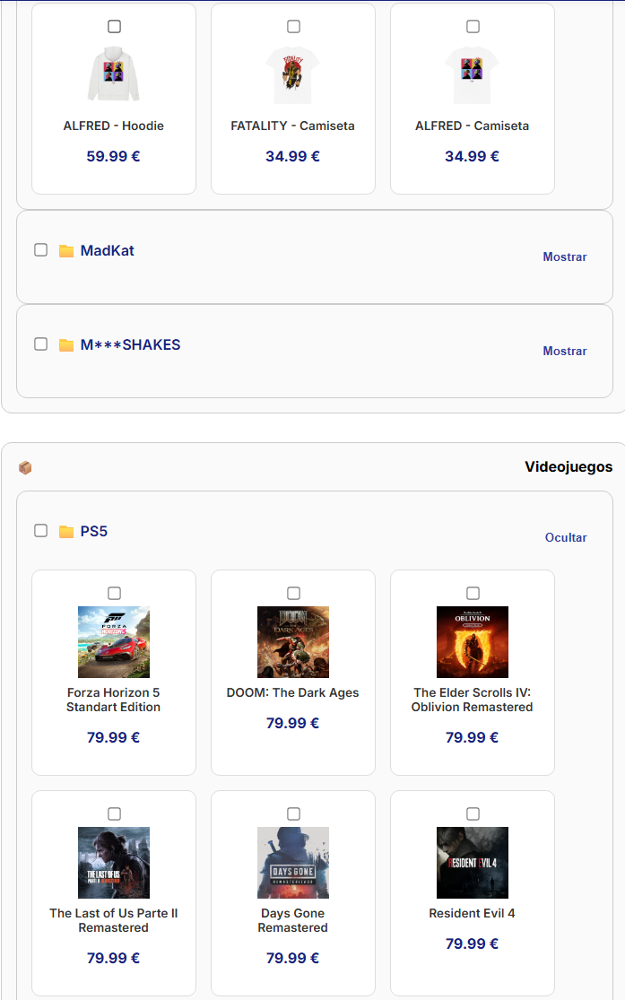

# 🚀 Pagezy

Crea y personaliza tu propia página web en segundos. Ideal para tiendas online, portfolios, periódicos digitales y más.


---

## 🌐 Acceso público

🔗 Demo en vivo: [https://pagezy.onrender.com](https://pagezy.onrender.com)  
📺 Video demostración: [YouTube - Pagezy Demo](https://youtube.com/your-demo-link)  
📄 Memoria del proyecto: [Descargar PDF](./Memoria_TFG_RubénCereceda.pdf)

---

## ⚙️ Tecnologías utilizadas

- Python 3.11
- Flask (servidor web)
- SQLAlchemy (ORM)
- Jinja2 (plantillas HTML)
- SCSS / CSS personalizado
- SQLite (base de datos por tienda)
- LocalStorage (gestión de carrito)
- Render (despliegue en la nube)

---

## 🧩 Funcionalidades principales

- Autogeneración de tiendas web personalizadas
- Panel de administración privado para cada tienda
- Gestión de productos, stock y pedidos
- Carrito de compra dinámico con persistencia en navegador
- Interfaz adaptable a dos plantillas (tienda 1 / tienda 2)
- Página pública para registro y configuración
- API para guardar pedidos y actualizarlos
- Compatible con despliegue en Render, Railway o VPS

---

## 💻 Ejecutar en local

### 1. Clona el repositorio

```bash
git clone https://github.com/tuusuario/pagezy.git
cd pagezy
```

### 2. Crea y activa un entorno virtual

```bash
python -m venv venv
source venv/bin/activate    # Linux/Mac
venv\Scripts\activate     # Windows
```

### 3. Instala las dependencias

```bash
pip install -r requirements.txt
```

### 4. Ejecuta la aplicación

```bash
python run.py
```

La aplicación se ejecutará en `http://127.0.0.1:5000`

---

## 📦 Estructura del proyecto

```
pagezy/
├── app/
│   ├── templates/
│   ├── static/
│   ├── routes/
│   ├── models/
│   └── __init__.py
├── run.py
├── requirements.txt
└── README.md
```

---
## 📸 Capturas

### 🛒 Tienda pública


### ⚙️ Panel de administración


### 🎨 Personalización


---

## 📌 Créditos

Proyecto desarrollado como Trabajo de Fin de Grado (TFG) para el curso 2024 por **Rubén**.
